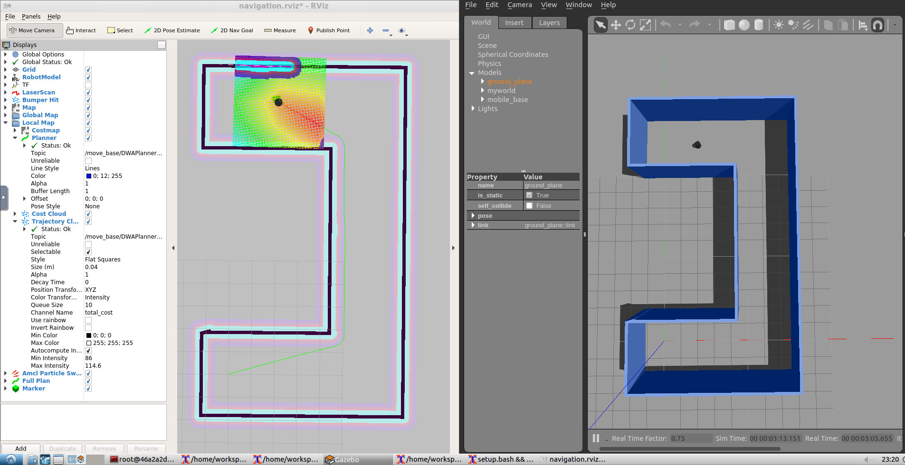

# RoboticsND-Home-Service-Robot
Home Service Robot in Kinetic ROS
![Localization and Navigation Testing][image9]
<!-- ![Localization and Navigation Testing2][image2] -->

<!-- [//]: # (Image References) -->
[image9]: https://github.com/bmaxdk/RoboticsND-Home-Service-Robot/blob/main/img/bb.gif "home_service"
![Localization and Navigation Testing][image10]
[image9]: https://github.com/bmaxdk/RoboticsND-Home-Service-Robot/blob/main/img/bb2.gif "home_Service2"
```bash
$ mkdir -p ~/catkin_ws/src
$ cd ~/catkin_ws/src
$ catkin_init_workspace
$ cd ..
$ catkin_make
$ sudo apt-get update
$ cd ~/catkin_ws/src
$ git clone https://github.com/ros-perception/slam_gmapping
$ git clone https://github.com/turtlebot/turtlebot
$ git clone https://github.com/turtlebot/turtlebot_interactions
$ git clone https://github.com/turtlebot/turtlebot_simulator
$ cd ~/catkin_ws/
$ source devel/setup.bash
$ rosdep -i install gmapping
$ rosdep -i install turtlebot_teleop
$ rosdep -i install turtlebot_rviz_launchers
$ rosdep -i install turtlebot_gazebo
$ catkin_make
$ source devel/setup.bash
```
## Shell Scripts
A ***shell script*** is a file containing a series of commands and could be executed. Use shell scripts when developing robotic software with different packages to avoid getting harder to track errors and bugs generated from different nodes. After you create a shell script file to launch one or many nodes each in separate terminals, you will have the power to track the output of different nodes and keep the convenience of running a single command to launch all nodes.

Install **xterm**: 
```bash
$ sudo apt-get install xterm
```

Goal here is to launch Gazebo and Rviz in separate instances of terminals.

Sample [`launch.sh`](https://github.com/bmaxdk/RoboticsND-Home-Service-Robot/blob/main/src/scripts/launch.sh) Script:
```sh
#!/bin/sh
xterm  -e  " gazebo " &
sleep 5
xterm  -e  " source /opt/ros/kinetic/setup.bash; roscore" & 
sleep 5
xterm  -e  " rosrun rviz rviz" 
```
Here, in the `launch.sh` shell script launches three terminals and issues one or multiple commands in each terminal. To save my script file and give it ***execute*** permission: `chmod +x launch.sh`. Then to launch the shell: `./launch.sh`

## SLAM Testing
Shell script [`test_slam.sh`](https://github.com/bmaxdk/RoboticsND-Home-Service-Robot/blob/main/src/scripts/test_slam.sh) that will deploy a turtlebot inside your environment, control it with keyboard commands, interface it with a SLAM package, and visualize the map in `rviz`.
```bash
$ source devel/setup.bash
$ cd src/script
$ ./test_slam.sh
```
Use `keyboard_teleop` node to map the world.

## Localization and Navigation Testing
![Localization and Navigation Testing][image1]
<!-- ![Localization and Navigation Testing2][image2] -->

[//]: # (Image References)
[image1]: https://github.com/bmaxdk/RoboticsND-Home-Service-Robot/blob/main/img/Nav3.gif "Localization and Navigation Testing"
<!-- [image2]: https://github.com/bmaxdk/RoboticsND-Home-Service-Robot/blob/main/img/a.gif "Localization and Navigation Testing2" -->

RTAB-Map is SLAM algorithm that can be used to create a map of an environment. [rtabmap_ros](http://wiki.ros.org/rtabmap_ros) package for simultaneous localization and mapping (SLAM) has some advantages over the gmapping package, such as the ability to create 3D maps and handle loop closures more effectively.

**To save the RTAM-Map 2D or 3D:**
```bash
$ rtabmap-databaseViewer rtabmap.db 
```
* Open the database: Run RTAB-Map standalone application (just type rtabmap in your terminal). Once the GUI is open, click on "File" -> "Open" in the top menu and select your map.db file.
* Export the 2D map: Go to "File" -> "Export 2D grid map..." and a dialogue window will open. In this window, you can adjust parameters such as the resolution of your map. Click "OK" and then you will be asked to specify the path and name of the output file. You can save the map as .png or .pgm, with an accompanying .yaml file for map metadata.
* Export the 3D map: If you want to export a 3D map (if you've been mapping in 3D), go to "File" -> "Export 3D cloud..." or "File" -> "Export 3D mesh...". This will allow you to save the 3D map in various formats (like .pcd, .ply, .vtk, etc.).

**To run test_navigation.sh:**
```bash
$ source devel/setup.bash
$ cd src/script
$ ./test_navigation.sh
```

**Robot Position Updated** in [map.yaml](https://github.com/bmaxdk/RoboticsND-Home-Service-Robot/blob/main/src/map/map.yaml) and [amcl_demo.launch](https://github.com/bmaxdk/RoboticsND-Home-Service-Robot/blob/main/src/turtlebot_simulator/turtlebot_gazebo/launch/amcl_demo.launch) to correct map where you can find in 'localization' section.
* In **amcl_demo.launch**, updated the yaw angle.
* In **map.yaml**, updated the position of the map location.

## Navigation Goal Node
### Sending Goals to the Navigation Stack
The ROS navigation stack creates a path for your robot based on **Dijkstra's algorithm**, a variant of the **Uniform Cost Search algorithm**, while avoiding obstacles on its path.
[Tutorial](http://wiki.ros.org/navigation/Tutorials/SendingSimpleGoals) is official ROS tutorial that teaches you how to send a single goal position and orientation to the navigation stack.
**Sample Code:**
```cpp
#include <ros/ros.h>
#include <move_base_msgs/MoveBaseAction.h>
#include <actionlib/client/simple_action_client.h>
 
// Define a client for to send goal requests to the move_base server through a SimpleActionClient
typedef actionlib::SimpleActionClient<move_base_msgs::MoveBaseAction> MoveBaseClient;

int main(int argc, char** argv){
  // Initialize the simple_navigation_goals node
  ros::init(argc, argv, "simple_navigation_goals");

  //tell the action client that we want to spin a thread by default
  MoveBaseClient ac("move_base", true);

  // Wait 5 sec for move_base action server to come up
  while(!ac.waitForServer(ros::Duration(5.0))){
    ROS_INFO("Waiting for the move_base action server to come up");
  }

  move_base_msgs::MoveBaseGoal goal;

  // set up the frame parameters
  goal.target_pose.header.frame_id = "base_link";
  goal.target_pose.header.stamp = ros::Time::now();
  
  // Define a position and orientation for the robot to reach
  goal.target_pose.pose.position.x = 1.0;
  goal.target_pose.pose.orientation.w = 1.0;

   // Send the goal position and orientation for the robot to reach
  ROS_INFO("Sending goal");
  ac.sendGoal(goal);
  
  // Wait an infinite time for the results
  ac.waitForResult();
  
  // Check if the robot reached its goal
  if(ac.getState() == actionlib::SimpleClientGoalState::SUCCEEDED)
    ROS_INFO("Hooray, the base moved 1 meter forward");
  else
    ROS_INFO("The base failed to move forward 1 meter for some reason");

  return 0;
}
```
It is important to edit the `frame_id` to `map`, since your fixed frame is the **map** and not `base_link`

**To creat pick_objects package with `move_base_msgs`, `actionlib`, `roscpp`:**
```bash
$ catkin_create_pkg pick_objects move_base_msgs actionlib roscpp
```

**To launch pick up object shell scripts:**
```bash
$ source devel/setup.bash
$ cd src/script
$ ./pick_objects.sh
```
* [pick_objects_old2.cpp](https://github.com/bmaxdk/RoboticsND-Home-Service-Robot/blob/main/src/pick_objects/src/pick_objects_old2.cpp) contains three position and stop every 5 seconds before sending each mission.
* [pick_objects.sh](https://github.com/bmaxdk/RoboticsND-Home-Service-Robot/blob/main/src/scripts/pick_objects.sh) shell scripts will show the robot move as shown bottom gif.

![Navigation Goal][image2]

[image2]: https://github.com/bmaxdk/RoboticsND-Home-Service-Robot/blob/main/img/Nav3.gif "Navigation Goal"

## Modeling Virtual Objects
[Markers: Sending Basic Shapes (C++)](http://wiki.ros.org/rviz/Tutorials/Markers%3A%20Basic%20Shapes) demonstrate a model a virtual object with **marker**s in rviz. The virtual object is the one being picked and delivered by the robot, thus it should first appear in its pickup zone, and then in its drop off zone once the robot reaches it.

[**Sample Code:**](https://raw.githubusercontent.com/ros-visualization/visualization_tutorials/indigo-devel/visualization_marker_tutorials/src/basic_shapes.cpp)
```cpp
#include <ros/ros.h>
#include <visualization_msgs/Marker.h>

int main( int argc, char** argv )
{
  ros::init(argc, argv, "basic_shapes");
  ros::NodeHandle n;
  ros::Rate r(1);
  ros::Publisher marker_pub = n.advertise<visualization_msgs::Marker>("visualization_marker", 1);

  // Set our initial shape type to be a cube
// %Tag(SHAPE_INIT)%
  uint32_t shape = visualization_msgs::Marker::CUBE;
// %EndTag(SHAPE_INIT)%

// %Tag(MARKER_INIT)%
  while (ros::ok())
  {
    visualization_msgs::Marker marker;
    // Set the frame ID and timestamp.  See the TF tutorials for information on these.
    marker.header.frame_id = "/my_frame";
    marker.header.stamp = ros::Time::now();
// %EndTag(MARKER_INIT)%

    // Set the namespace and id for this marker.  This serves to create a unique ID
    // Any marker sent with the same namespace and id will overwrite the old one
// %Tag(NS_ID)%
    marker.ns = "basic_shapes";
    marker.id = 0;
// %EndTag(NS_ID)%

    // Set the marker type.  Initially this is CUBE, and cycles between that and SPHERE, ARROW, and CYLINDER
// %Tag(TYPE)%
    marker.type = shape;
// %EndTag(TYPE)%

    // Set the marker action.  Options are ADD, DELETE, and new in ROS Indigo: 3 (DELETEALL)
// %Tag(ACTION)%
    marker.action = visualization_msgs::Marker::ADD;
// %EndTag(ACTION)%

    // Set the pose of the marker.  This is a full 6DOF pose relative to the frame/time specified in the header
// %Tag(POSE)%
    marker.pose.position.x = 0;
    marker.pose.position.y = 0;
    marker.pose.position.z = 0;
    marker.pose.orientation.x = 0.0;
    marker.pose.orientation.y = 0.0;
    marker.pose.orientation.z = 0.0;
    marker.pose.orientation.w = 1.0;
// %EndTag(POSE)%

    // Set the scale of the marker -- 1x1x1 here means 1m on a side
// %Tag(SCALE)%
    marker.scale.x = 1.0;
    marker.scale.y = 1.0;
    marker.scale.z = 1.0;
// %EndTag(SCALE)%

    // Set the color -- be sure to set alpha to something non-zero!
// %Tag(COLOR)%
    marker.color.r = 0.0f;
    marker.color.g = 1.0f;
    marker.color.b = 0.0f;
    marker.color.a = 1.0;
// %EndTag(COLOR)%

// %Tag(LIFETIME)%
    marker.lifetime = ros::Duration();
// %EndTag(LIFETIME)%

    // Publish the marker
// %Tag(PUBLISH)%
    while (marker_pub.getNumSubscribers() < 1)
    {
      if (!ros::ok())
      {
        return 0;
      }
      ROS_WARN_ONCE("Please create a subscriber to the marker");
      sleep(1);
    }
    marker_pub.publish(marker);
// %EndTag(PUBLISH)%

    // Cycle between different shapes
// %Tag(CYCLE_SHAPES)%
    switch (shape)
    {
    case visualization_msgs::Marker::CUBE:
      shape = visualization_msgs::Marker::SPHERE;
      break;
    case visualization_msgs::Marker::SPHERE:
      shape = visualization_msgs::Marker::ARROW;
      break;
    case visualization_msgs::Marker::ARROW:
      shape = visualization_msgs::Marker::CYLINDER;
      break;
    case visualization_msgs::Marker::CYLINDER:
      shape = visualization_msgs::Marker::CUBE;
      break;
    }
// %EndTag(CYCLE_SHAPES)%

// %Tag(SLEEP_END)%
    r.sleep();
  }
// %EndTag(SLEEP_END)%
}

```
Make sure that frame_id is set to **map**. This is because the markers are being placed in the map frame, which is the global reference frame for the robot's environment.
The tutorial is an excellent reference and includes a C++ node capable of drawing basic shapes like arrows, cubes, cylinders, and spheres in rviz. This will teach how to define a marker, scale it, define its position and orientation, and finally publish it to rviz. The node included in the [tutorial](http://wiki.ros.org/rviz/Tutorials/Markers%3A%20Basic%20Shapes) will publish a different shape each second at the same position and orientation.

**To launch add_markers shell scripts:**
```bash
$ source devel/setup.bash
$ cd src/script
$ ./add_markers.sh
```
* [add_markers_old2.cpp](https://github.com/bmaxdk/RoboticsND-Home-Service-Robot/tree/main/src/add_markers/src) contains two markers.
    * In the **rviz displays** panel, the **Marker** item that should have appeared in **Displays** panel, there should be a field called **Marker Topic**.
    * Updated **rviz** is saved into [rvizConfig](https://github.com/bmaxdk/RoboticsND-Home-Service-Robot/blob/main/src/rvizConfig/add_marker.rviz)
* [add_marker.sh](https://github.com/bmaxdk/RoboticsND-Home-Service-Robot/blob/main/src/scripts/add_marker.sh) shell scripts will show the markers as shown bottom gif.

[image3]: img/a3.png "img3"
[image4]: img/a4.png "img4"
[image55]: img/a55.png "img55"
[image5]: img/a5.png "img5"
[image6]: img/a6.png "img6"
![alt text][image3]
  
  

## Home Service Robot
Simulate a full home service robot capable of navigating to pick up and deliver virtual objects.
**To launch home_service shell scripts:**
```bash
$ source devel/setup.bash
$ cd src/script
$ ./home_service.sh
```
* [add_markers.cpp](https://github.com/bmaxdk/RoboticsND-Home-Service-Robot/tree/main/src/add_markers/src) contains two markers.
    * In the **rviz displays** panel, the **Marker** item that should have appeared in **Displays** panel, there should be a field called **Marker Topic**.
    * Updated **rviz** is saved into [rvizConfig](https://github.com/bmaxdk/RoboticsND-Home-Service-Robot/blob/main/src/rvizConfig/add_marker.rviz)
* [home_service.sh](https://github.com/bmaxdk/RoboticsND-Home-Service-Robot/blob/main/src/scripts/add_marker.sh) shell scripts will show the markers as shown bottom gif.

  
  
![alt text][image6]

